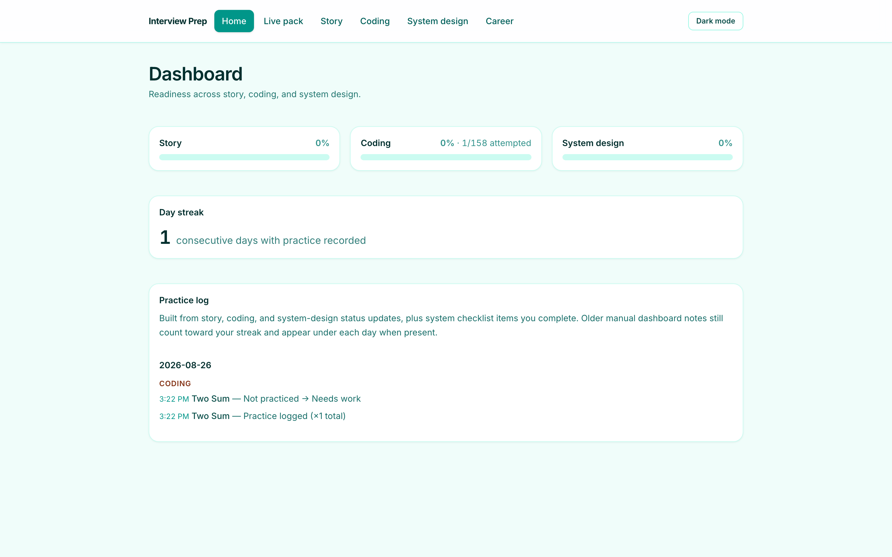
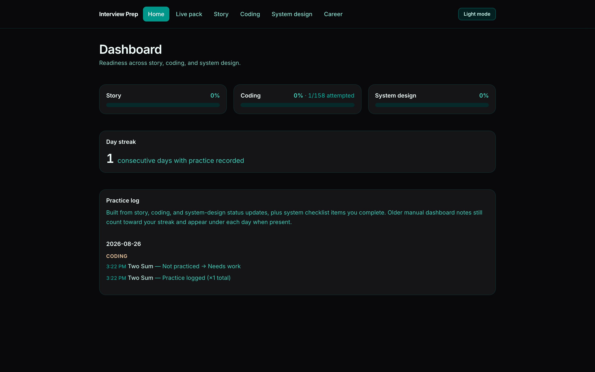
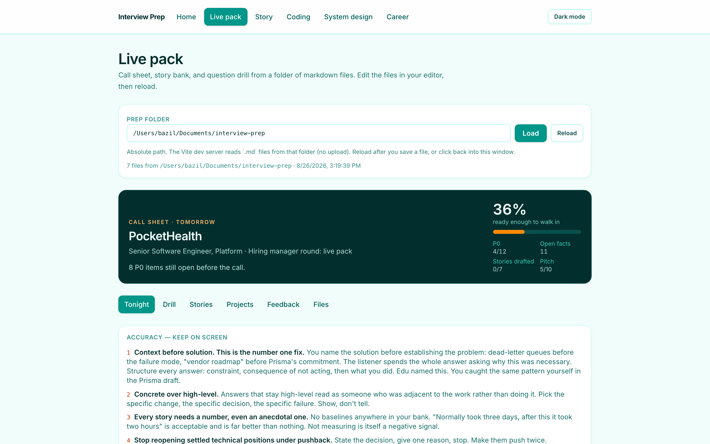
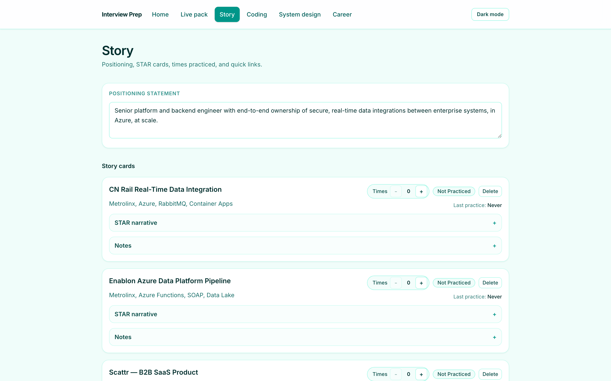
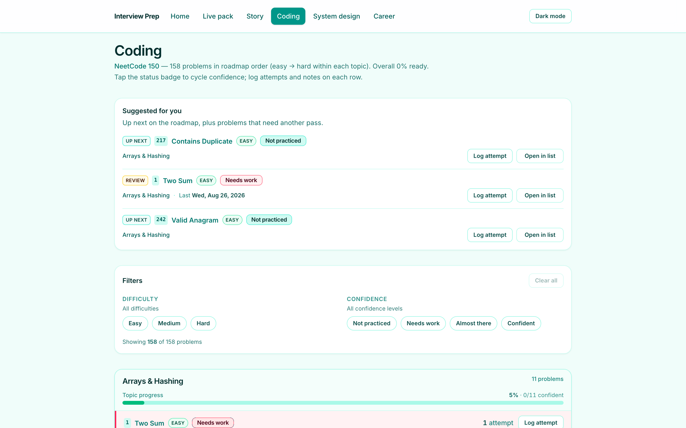
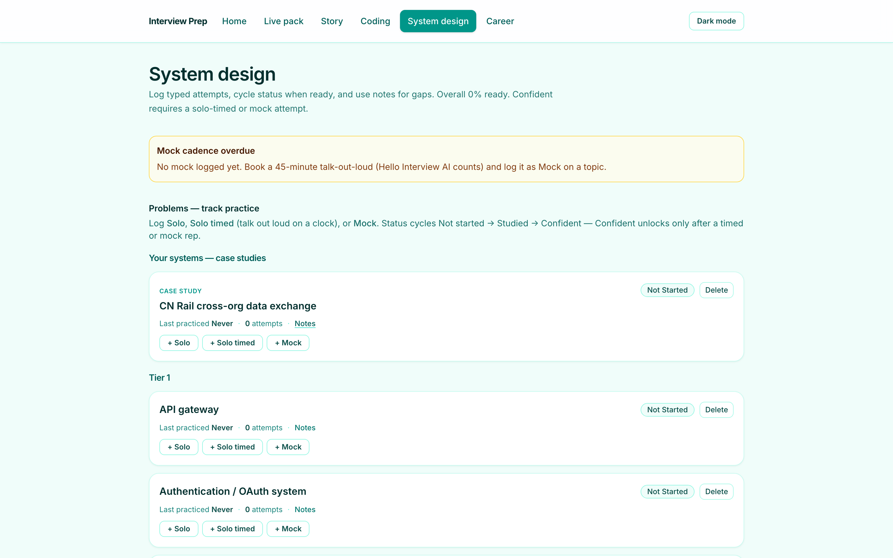
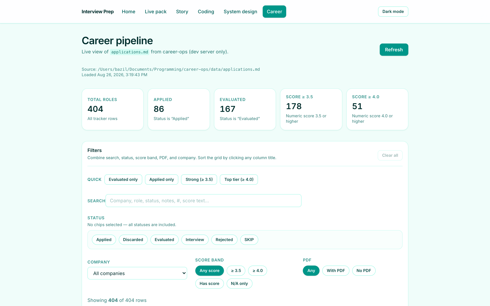

# Interview Prep Dashboard

Local dashboard for senior software interview prep. It tracks behavioral stories, NeetCode 150 progress, and system-design practice in the browser, and (in `npm run dev`) can read a markdown prep folder plus a career-ops application tracker from disk.

There is no hosted backend. Prep state lives in `localStorage`. The Career and Live pack tabs call Vite dev-server plugins that read files from your machine.

## Screenshots

### Dashboard

Readiness for story, coding, and system design, a consecutive-day streak, and a practice log grouped by local calendar day.



Dark mode:



### Live pack

Call sheet, tonight's work, story bank, and question drill, parsed from a folder of markdown files. Edit the files in your editor and reload.



### Story

Positioning statement, STAR cards, practice counts, and quick links.



### Coding

NeetCode 150 (plus a small extra string set) in roadmap order, with suggestions, filters, notes, and attempt logging.



### System design

Tiered topics, personal case studies, typed attempts (solo / solo timed / mock), and a study checklist. **Confident** requires a solo-timed or mock attempt.



### Career

Read-only view of `applications.md` from a local career-ops checkout. Filter and sort locally. This tab only works with the Vite dev server.



## Features

| Tab | What it does |
| --- | --- |
| **Home** | Weighted readiness, day streak, practice log. If coding progress looks empty, you can restore from other `interview-prep` keys in this browser. |
| **Live pack** | Reads `.md` files from a folder you point at. Builds a call sheet, P0 list, drill cards, stories, projects, and feedback. Marks questions as rehearsed in `localStorage`. |
| **Story** | Positioning statement, STAR cards (create / edit / delete), status cycle (`not practiced` → `needs work` → `confident`), practice count, links. |
| **Coding** | Catalog keyed by LeetCode number. Cycle confidence (`not practiced` → `needs work` → `almost there` → `confident`), log attempts, notes, difficulty/confidence filters, up to three suggestions. Add custom problems. |
| **System design** | Topics by tier, case studies, attempt kinds, notes, ranked resources, study-plan checklist. |
| **Career** | Parses the career-ops tracker table. Summary counts, search, status/company/score/PDF filters, sortable columns. |

Readiness is a weighted average, rounded to the nearest percent:

- Story: `not_practiced = 0`, `needs_work = 0.5`, `confident = 1`
- Coding: `not_practiced = 0`, `needs_work = 0.5`, `almost_there = 0.75`, `confident = 1`
- System design: `not_started = 0`, `studied = 0.5`, `confident = 1`

Streaks and “last practiced” use the **local calendar day**, not UTC.

## Run locally

Needs Node.js 20+ (Vite 8).

```bash
cp .env.example .env   # optional; see below
npm install
npm run dev
```

Open [http://localhost:5173](http://localhost:5173).

Other scripts:

```bash
npm run build    # typecheck + production bundle
npm run preview  # serve the bundle (Career and Live pack APIs are not available)
npm run lint
```

## Optional local files (dev server only)

Copy `.env.example` to `.env`. Neither variable is bundled into the client.

```bash
# Absolute path to a career-ops checkout. Used for GET /api/career-ops/applications.
CAREER_OPS_PATH=/Users/you/Documents/Programming/career-ops

# Absolute path to a folder of interview-prep markdown files (Live pack).
# You can also paste a path in the Live pack tab.
INTERVIEW_PREP_PATH=/Users/you/Documents/interview-prep
```

### Career tracker

The plugin looks for `applications.md` at the career-ops root or in `data/applications.md`. It is a markdown table; columns are matched by header name (so extra columns do not shift Score/Status).

### Live pack markdown

The plugin reads up to 80 `.md` files in that folder (not nested). Files are classified by name:

| Filename contains | Used as |
| --- | --- |
| `todo` or `to-do` | P0 / tonight checklist |
| `story-bank` | STAR story bank |
| `answer-bank` or `behavioral` | Spoken answers / drill |
| `project-context` or `context-sheet` | Project cards |
| `feedback` | Recurring corrections |
| `coaching` | Interview date, role, notes |
| `prep` (and ends in `.md`) | Live-pack questions for the next call |
| anything else | Listed under Files |

## Persistence

All prep state is one JSON document in the browser:

- `interview-prep-v1` — current save
- `interview-prep-v1-backup` — last known coding snapshot (for recovery)

Clearing site data for this origin wipes progress. Live pack rehearsed flags are stored separately per folder path.

A proposed authenticated backend (not implemented) is sketched in [`design.md`](design.md).

## Stack

- React 19 + TypeScript
- Vite 8 (`@vitejs/plugin-react`)
- Tailwind CSS 4
- React Router 7
